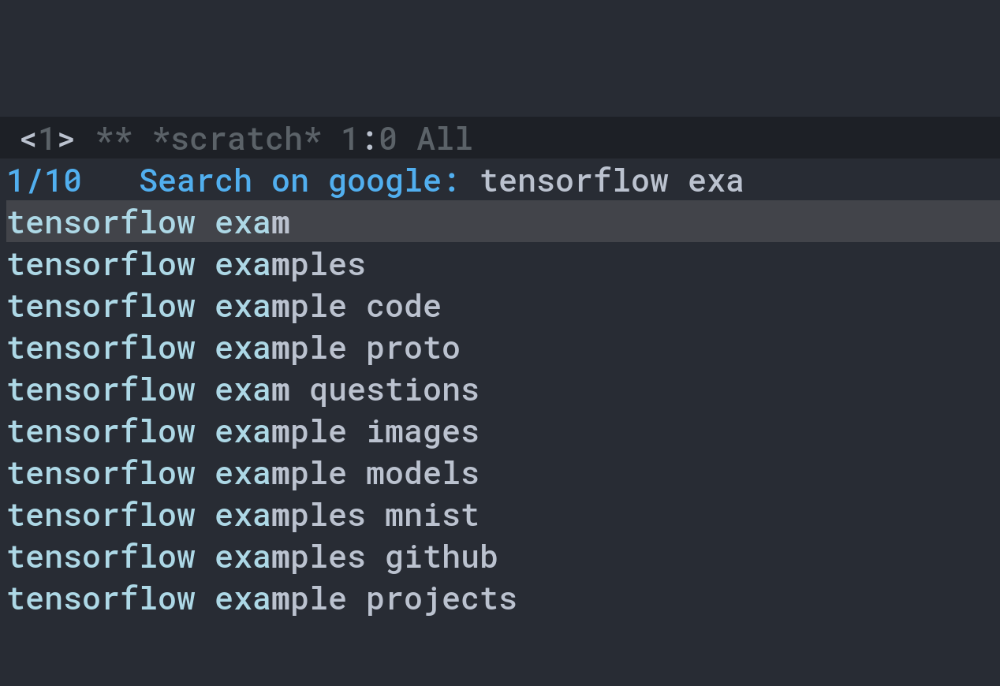
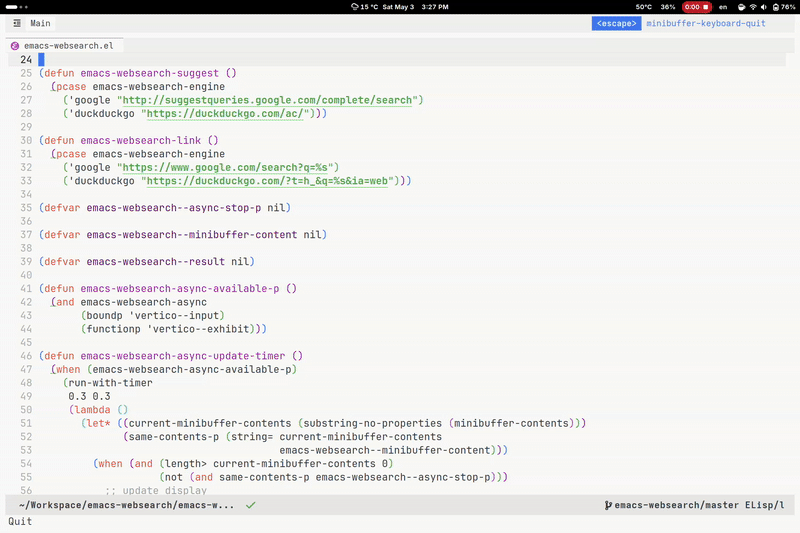

# emacs-websearch
Use request.el to search things on web

This is a simple package which let you search anything on web using emacs. It can be used with Vertico! Currently, it supports DuckDuckGo and Google. Other search engine would be added soon.

The default browser can be changed by modifying the builtin variable in emacs `browse-url-browser-function`, e.g.

- `(setq browse-url-browser-function 'xwidget-webkit-browse-url)`
- `(setq browse-url-browser-function 'eaf-open-browser)`
- `(setq browse-url-browser-function 'eww-browse-url)`
- `(setq browse-url-browser-function 'browse-url-default-browser)`, external browsers, e.g. firefox.

When there is no mark set, the default search term is set to `thing-at-point`. When envoked on an active region, the default serach term is set to the region's content.

## Installation

Using `straight.el`
```
(use-package emacs-websearch
  :straight '(emacs-websearch :host github :repo "zhenhua-wang/emacs-websearch")
  :bind (("C-c l" . emacs-websearch)))
```

Using `vc-use-package` in emacs 30
```
(use-package emacs-websearch
  :vc (:url "https://github.com/zhenhua-wang/emacs-websearch")
  :bind (("C-c l" . emacs-websearch)))
```

## Configuration

- Asynchronously search is available for Consult/Vertico users. To use this, `(setq emacs-websearch-async t)`
- DuckDuckGo and Google are supported, and the default search engine is DuckDuckGo. This can be changed by `(setq emacs-websearch-engine 'google)`
- *Remote* TTY users are recommended to use DuckDuckGo with `(setq browse-url-browser-function 'eww-browse-url)`

## Example




