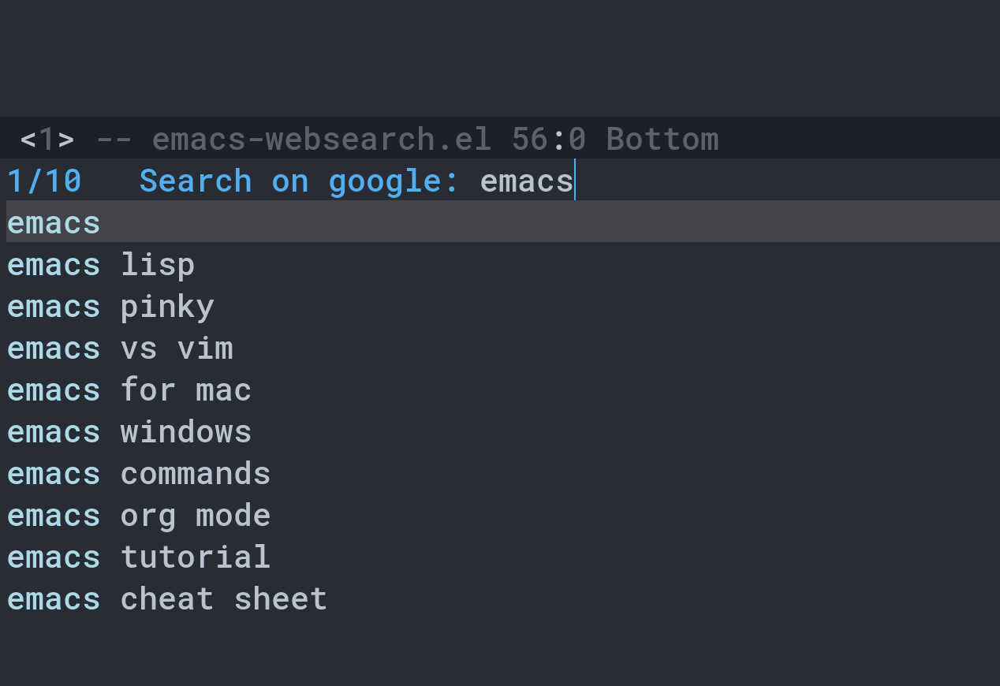

# emacs-websearch
Use request.el to search things on web

This is a simple package which let you search anything on web using emacs. It can be used with Vertico! Currently, it only supports google. other search engine would be added soon. 

